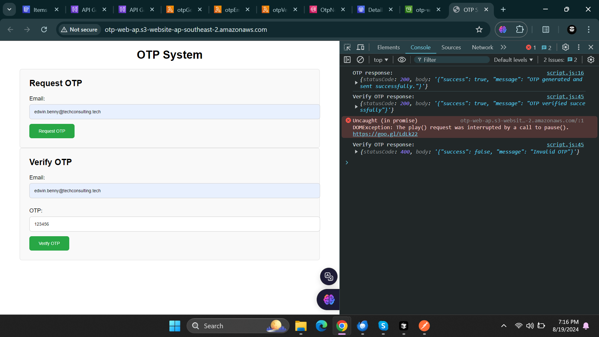

# Project 02 - OTP Generation and Verification System Using Lambda Functions

This project implements a secure OTP (One-Time Password) generation and verification system using AWS services. The system sends a single-use OTP to the user's email and verifies it within a specified time frame. Below is a detailed explanation of the system, including all components and how they work together.

## Table of Contents

- [Architecture Overview](#architecture-overview)
- [Components](#components)
  - [Lambda Functions](#lambda-functions)
  - [API Gateway](#api-gateway)
  - [DynamoDB](#dynamodb)
  - [SNS](#sns)
  - [SES](#ses)
  - [S3 Bucket and Static Webpage](#s3-bucket-and-static-webpage)
- [Single Use Token](#single-use-token)
- [Deployment](#deployment)
- [Usage](#usage)
- [Security Considerations](#security-considerations)

## Architecture Overview

The system consists of a static website hosted on an S3 bucket, which interacts with various AWS services via API Gateway and Lambda functions. When a user requests an OTP, the backend generates a single-use token, stores it in DynamoDB, and sends it to the user’s email via SNS and SES. The user can then enter the OTP on the website, and the system will verify its validity.

## Components

### Lambda Functions

There are three main Lambda functions in this project:

1. **Generate OTP**:
    - This function is triggered when a user requests an OTP.
    - It generates a random 6-digit OTP and stores it in a DynamoDB table with a timestamp and status (`unused`).
    - The OTP is then sent to the user's email using SNS, which triggers an SES notification.
    - **Key Points**:
        - Random OTP generation.
        - Storage in DynamoDB.
        - Sending OTP via SNS and SES.
     

2. **Send OTP Email**
    - This Lambda function is triggered after OTP generation.
    - It sends the generated OTP to the user via email using Amazon SES.
    - **Key Points**:
        - Sending OTP through email.
        - Integration with SES.

3. **Verify OTP**
    - This Lambda function is triggered when the user submits the OTP for verification.
    - It retrieves the OTP from DynamoDB and checks if it matches the one provided by the user.
    - If valid and unused, the OTP is marked as `used`, and the verification is successful.
    - This Lambda function is also responsible for cleaning up expired OTPs in the DynamoDB table.
    - It runs on a scheduled basis (e.g., every hour) and deletes any OTPs that have expired and were not used.
    - **Key Points**:
        - OTP retrieval and verification.
        - Status update to `used` upon successful verification.
        - Scheduled cleanup of expired tokens.

### API Gateway

- The API Gateway acts as the interface between the static website and the Lambda functions.
- It has two main endpoints:
    - `/generate-otp`: Invokes the Generate OTP Lambda function.
    - `/verify-otp`: Invokes the Verify OTP Lambda function.
- The API Gateway handles CORS (Cross-Origin Resource Sharing) to allow requests from the S3-hosted website.

### DynamoDB

- A DynamoDB table (`OtpTable`) is used to store the OTPs along with their associated email, status, and expiration timestamp.
- The table has the following attributes:
    - `email`: The primary key, representing the user's email.
    - `otp`: The generated OTP.
    - `expirationTime`: The expiration timestamp for the OTP.
    - `status`: The status of the OTP (`unused` or `used`).

### SNS

- SNS (Simple Notification Service) is used to send the OTP to the user’s email.
- The SNS topic (`OtpNotificationTopic`) triggers an SES email with the OTP as soon as it is published.

### SES

- SES (Simple Email Service) is used to send the OTP to the user's email address.
- SES is configured to send emails only to verified email addresses or domains.
- The OTP is included in the body of the email.

### S3 Bucket and Static Webpage

- The static website is hosted on an S3 bucket configured for static website hosting.
- The website includes a form for users to enter their email to request an OTP and a form to verify the OTP.
- The website interacts with the API Gateway to trigger the appropriate Lambda functions.

## Single Use Token

The OTP generated is a single-use token, meaning it can only be used once and will be marked as `used` after successful verification. This ensures that the OTP cannot be reused, enhancing the security of the system.

## Deployment

To deploy this project, follow these steps:

1. **Create an S3 Bucket**:
   - Set up an S3 bucket with static website hosting.
   - Upload your static website files (HTML, CSS, JS) to the bucket.

2. **Set Up DynamoDB**:
   - Create a DynamoDB table named `OtpTable` with `email` as the primary key.

3. **Create Lambda Functions**:
   - Deploy the three Lambda functions (Generate OTP, Verify OTP, Cleanup Expired OTPs) with appropriate IAM roles.

4. **Configure API Gateway**:
   - Create an API Gateway with two endpoints (`/generate-otp`, `/verify-otp`) that invoke the corresponding Lambda functions.
   - Enable CORS for these endpoints.

5. **Set Up SNS and SES**:
   - Create an SNS topic (`OtpNotificationTopic`) and configure it to send emails via SES.
   - Verify email addresses/domains in SES.

6. **Deploy the Static Website**:
   - Deploy the static website to the S3 bucket.

## Usage

1. **Request OTP**:
   - Users visit the website and enter their email to request an OTP.
   - The OTP is sent to their email and stored in DynamoDB.

2. **Verify OTP**:
   - Users enter the OTP on the website to verify it.
   - The system checks the OTP in DynamoDB and marks it as `used` upon successful verification.

## Security Considerations

- **Single Use**: OTPs are single-use, reducing the risk of replay attacks.
- **Expiration**: OTPs expire after a specified time, limiting the window for potential misuse.
- **CORS Configuration**: Proper CORS settings are applied to ensure secure communication between the website and API Gateway.
- **IAM Roles**: Lambda functions have minimal permissions to interact with AWS services, following the principle of least privilege.

## Postman 

1. **Generate OTP**
    - **Endpoint**: `POST /prod/generate-otp`
    - **Description**: Initiates the OTP generation process.
    - **Request**: Send a POST request to the endpoint with the necessary parameters (e.g., user email or ID).
    - **Expected Response**: Success confirmation and an OTP should be sent to the user’s email.

**The OTP is send to the registered email**

2. **Verify OTP**
    - **Endpoint**: `POST /prod/verify-otp`
    - **Description**: Submits the OTP for verification.
    - **Request**: Send a POST request with the OTP and user identifier.
    - **Expected Response**: Confirmation of successful verification if the OTP is valid and unused.

3. **Cleanup Expired OTPs**
    - **Endpoint**: (Not directly tested via Postman)
    - **Description**: Automatically triggered function to clean up expired OTPs.
    - **Testing**: Verify that the cleanup function runs as scheduled by checking DynamoDB to ensure expired OTPs are removed.

**The generated OTP can be used only once**

## Static Webpage hosted on S3

**Generating OTP through the webpage**

**Verifying OTP through the webpage**

**Invalid OTP via webpage**

